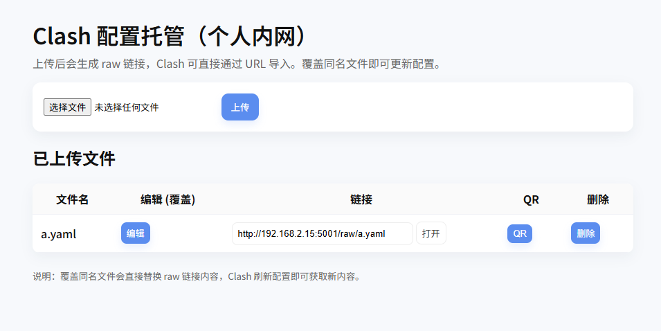
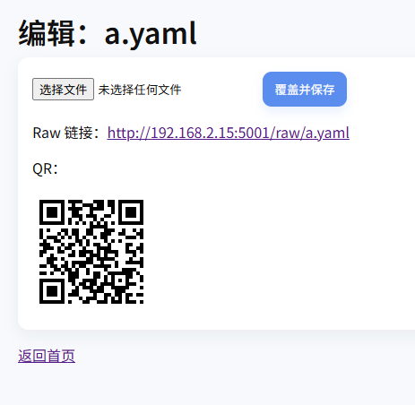

# Clash Config File Hosting Service (Personal Lightweight Edition)

本项目为个人使用的轻量级 Clash 配置文件托管与在线管理服务，可通过网页上传、编辑 Clash 配置文件，并生成访问链接或扫码导入到 Clash Meta / Clash for Android 等客户端。

本服务适合旁路由、自用机场面板、本地 Proxy 管理等场景。

---

## 功能特性

- 网页上传 Clash 配置文件（支持 `.yaml`, `.yml`, `.txt`）
- 文件列表展示，支持查看 Raw 链接与扫描 QR 码导入
- 编辑功能支持上传新文件覆盖
- 提供二维码扫码导入链接，支持点击遮罩关闭弹窗
- UI 简洁，支持移动端操作
- 通过 **Docker 一键部署**，无需额外环境
- 配置文件保存在宿主机目录 `./data/configs`
- 不含登录体系，适用于内网 / 信任环境使用

> 后续功能已列入后续开发计划（见 `ROADMAP.md`）。

---

## 截图演示





---

## 页面说明

### 主页 `/`

- 文件上传按钮
- 已上传文件列表（文件名 / 编辑 / 查看链接 / 显示二维码）
- 点击“编辑”可选择新文件直接覆盖存量配置文件
- 点击“链接”可复制 Clash 导入 URL
- 点击“二维码”直接使用手机扫码导入

---

## 环境依赖

确保已安装以下环境：

- **Python 3.x**
- **Flask**
- **gunicorn**
- **qrcode[pil]**

使用以下命令安装依赖：

```bash
pip install --no-cache-dir -r requirements.txt
```

---

## 部署指南

### Docker

#### 1. 构建镜像

```bash
docker build -t clash-config-server .
```

#### 2. 启动容器

```bash
docker run -d \
  -p 8000:8000 \
  -v /path/to/data:/app/storage \
  --name clash-config-server \
  clash-config-server
```

#### 3. 访问页面

```cpp
http://<服务器IP>:8000
```

---

## 客户端导入方式

**Clash Meta** **/** **Clash for Android**

复制链接：

```URL
http://<服务器IP>:8000/raw/<文件名>.yaml
```

或手机直接扫码导入。

---

## 使用流程

1. 打开主页

2. 上传 Clash 配置文件（上传后将自动出现在列表中）

3. 点击 链接 获取可供 Clash 导入的 Raw 地址

4. 点击 QR 可扫描该链接到手机

5. 若需更新配置，点击 编辑 上传新文件覆盖即可

6. Clash 客户端刷新订阅后将自动获取最新内容

---

## 推荐使用环境

局域网或 ZeroTier / Tailscale 私网访问

不建议直接暴露公网（除非在后续启用 token / 登录体系）

---

## 文件结构

``` csharp
clash-host/
├─ data/                   # 存储上传的配置文件
├─ templates/              # 前端模板（HTML）
│  ├─ index.html
│  └─ edit.html
├─ static/                 # CSS / JS / 前端资源
│  └─ style.css
├─ Dockerfile
├─ docker-compose.yml
├─ requirements.txt
└─ app.py                  # Flask 主程序

```

---

## 🛠️ 可能遇到的问题

| 问题        | 说明        |
| ----------- | ----------- |
| Clash 导入不生效    | 确认导入的 URL 是 **raw 地址**，并点击 Clash 中的刷新/更新。 |
| 覆盖上传后内容未更新 | 客户端有缓存，手动刷新配置或重启 Clash 即可。                |
| 内网访问不了        | 请确认服务器 IP 可访问，或关闭防火墙。                       |
